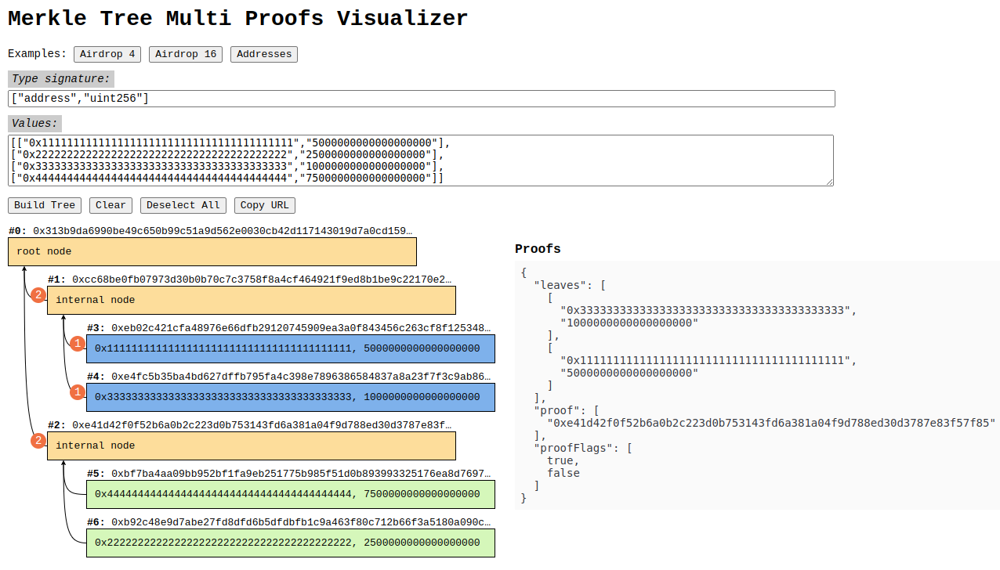

# Merkle Tree Multi Proofs Visualizer



## What is it?

## Key Features

## Who is it for?

## How to Use

## How to Run Locally

To run the project locally, follow these steps:

```bash
git clone git@github.com:PurrProof/merkle-proofs-vis.git
cd merkle-proofs-vis
pnpm i
pnpm start
```

This project uses `pnpm` as the package manager for faster and more efficient dependency management. If you prefer using another package manager, simply replace `pnpm` with `npm`, `yarn`, or any other package manager you prefer in the commands above.

## Credits

This project is built using several open-source tools and libraries. I would like to give credit to the authors and maintainers of the following:

- [@openzeppelin/merkle-tree](https://github.com/OpenZeppelin/merkle-tree) – A JavaScript library to generate merkle trees and merkle proofs.
- [React](https://reactjs.org/) – The UI framework used to build the interactive application.
- [Create-React-app](https://github.com/facebook/create-react-app) – Create React apps with no build configuration.
- [React-xarrows](https://github.com/Eliav2/react-xarrows) – Used to draw arrows between elements in the visual representation of calldata.
- [Zustand](https://github.com/pmndrs/zustand) – A lightweight state management library used to manage the application's state.
- [Ethers.js](https://github.com/ethers-io/ethers.js) – Used for ABI decoding and interacting with Ethereum data (a customized version was used).
- [And Design Colors](https://github.com/ant-design/ant-design-colors) - Color Palettes Calculator of Ant Design
- [Copy-to-clipboard](https://github.com/sudodoki/copy-to-clipboard) – Enables the copy-to-clipboard functionality for sharing calldata and visualizations.
- [Lz-string](https://github.com/pieroxy/lz-string) - LZ-based compression algorithm for JavaScript.
- [Pnpm](https://pnpm.io) – Fast, disk space efficient package manager.
- [Flowbyte](https://github.com/themesberg/flowbite) – Nice icons.

### Other Dependencies

In addition to the main tools listed above, this project also uses various other libraries and tools from the JavaScript/React ecosystem to provide additional functionality.

I extend my thanks to the open-source community for their contributions and support!
